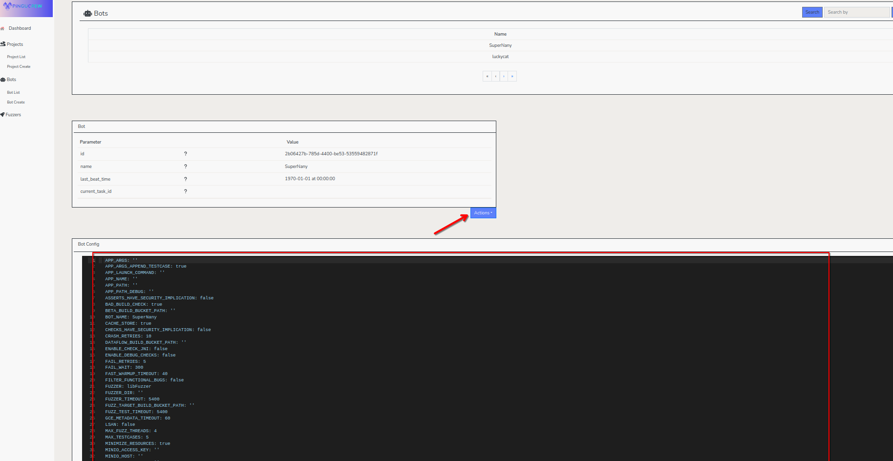

# PinguBot Documentation

## Introduction

PinguBot is a  automation bot designed to handle fuzzing, crash analysis, and regression testing tasks. It integrates seamlessly with the Pingu SDK to provide a robust framework for managing test cases, analyzing crashes, and automating workflows. PinguBot is ideal for developers and QA teams working on complex software projects.

## Bot Tasks and Capabilities

PinguBot is capable of performing the following tasks:

- **Fuzzing Automation:** Runs fuzzing tasks using various engines like libFuzzer and blackbox fuzzers.
- **Crash Analysis:** Analyzes crashes, determines their root causes, and categorizes them based on severity.
- **Regression Testing:** Identifies the commit ranges where regressions were introduced.
- **Progression Testing:** Verifies whether test cases are fixed in newer builds.
- **Testcase Minimization:** Reduces test cases to their minimal reproducible form.
- **Corpus Management:** Handles corpus pruning and synchronization for fuzzing tasks.
- **Task Orchestration:** Manages task execution and dependencies using a modular architecture.

## Installation

### Local Installation

To install PinguBot locally, follow these steps:

1. Clone the repository:

   ```bash
   git clone https://github.com/your-repo/pingucrew.git
   cd pingucrew/src/pingubot
   ```
2. Install dependencies:

   ```bash
   pip install -r requirements.txt
   ```
3. Configure the bot by editing the configuration file:

   ```bash
   cp config.example.json config.json
   # Update `config.json` with your settings
   ```
4. Start the bot:

   ```bash
   python butler.py run_bot -c config test-bot
   ```

### Installation with Docker Compose

To run PinguBot using Docker Compose, follow these steps:

1. Ensure `docker-compose` is installed on your system.
2. Navigate to the `pingubot` directory:

   ```bash
   cd pingucrew/src/pingubot
   ```
3. Start the bot using `docker-compose`:

   ```bash
   docker-compose up -d
   ```
4. Check the logs to ensure the bot is running:

   ```bash
   docker-compose logs -f
   ```

## Usage

In order to run the bot, the `butler.py` launcher can be used as follows:

```bash
python butler.py run_bot -c config test-bot
```

### Command-Line Parameters

- **`run_bot`**: This is the main command to start the bot. It initializes and runs the bot's tasks.
- **`-c config`**: Specifies the configuration directory. Replace `config` with the path to your configuration folder containing the necessary settings for the bot.
- **`test-bot`**: Specifies the bot folder where all the execution will be performed. Replace `test-bot` with the path to the folder containing the bot's runtime data and task definitions.

## Fuzzing Sessions

PinguBot supports three types of fuzzing sessions:

1. **Engine-Based Fuzzing**:Utilizes fuzzing engines like libFuzzer to generate inputs and test the target application. This type of fuzzing is ideal for structured input formats and provides detailed crash reports.
2. **Blackbox Fuzzing**:Runs the target application as a blackbox, generating random inputs without requiring knowledge of the internal structure. This approach is suitable for testing APIs, web services, or applications with unstructured input.
3. **Two-Stage Blackbox Fuzzing**:
   Combines blackbox fuzzing with a secondary stage of input refinement. The first stage generates random inputs, while the second stage focuses on inputs that trigger interesting behaviors or crashes.

## Bot Configuration

The bot configuration is managed through a `config.yaml` file located in the `config` folder. This file is generated automatically when a new bot is created in the system using the web application.

### How It Works

1. **Bot Creation**:When a new bot is created in the backend system via the web application, the backend generates a default `config.yaml` file. This file contains all the necessary settings, including an API key to communicate with the backend.

   
2. **Downloading the Configuration**:After the bot is created, the backend provides the `config.yaml` file. You must download this file and overwrite the existing `config.yaml` in the `config` folder.
3. **Modifying the Configuration**:
   The default configuration can be modified to suit your specific requirements. Ensure that the API key and other critical settings are not altered unless necessary.

### Example Configuration

Below is an example of a `config.yaml` file:

```yaml
APP_ARGS: ''
BOT_NAME: luckycat
PINGUAPI_HOST: http://127.0.0.1:8086
PINGUAPI_KEY: AUTOGENERATED_BY_BACKEND
FUZZER: libFuzzer
PLATFORM: Linux
TEST_TIMEOUT: 10
MAX_FUZZ_THREADS: 4
```

### Important Notes

- **API Key**: The `PINGUAPI_KEY` is critical for communication with the backend. Do not share or expose this key.
- **Overwriting Configuration**: Always overwrite the existing `config.yaml` with the one provided by the backend when creating a new bot.
- **Backup**: Keep a backup of your modified configuration in case you need to restore it.
